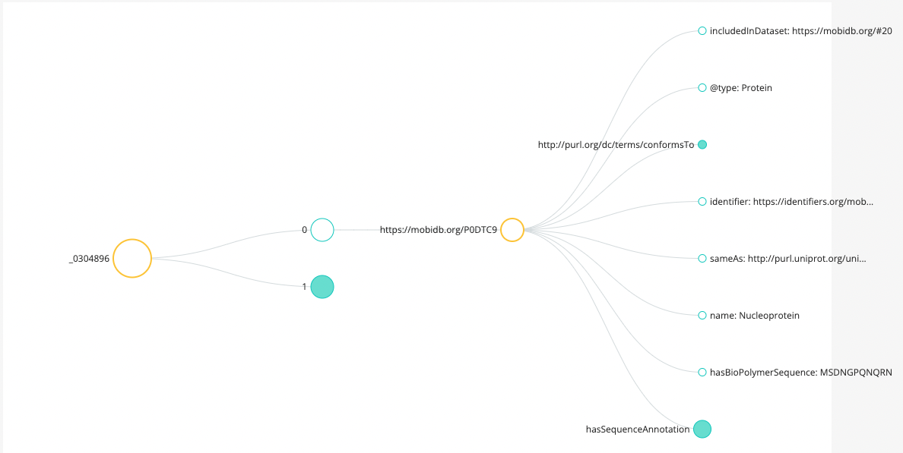
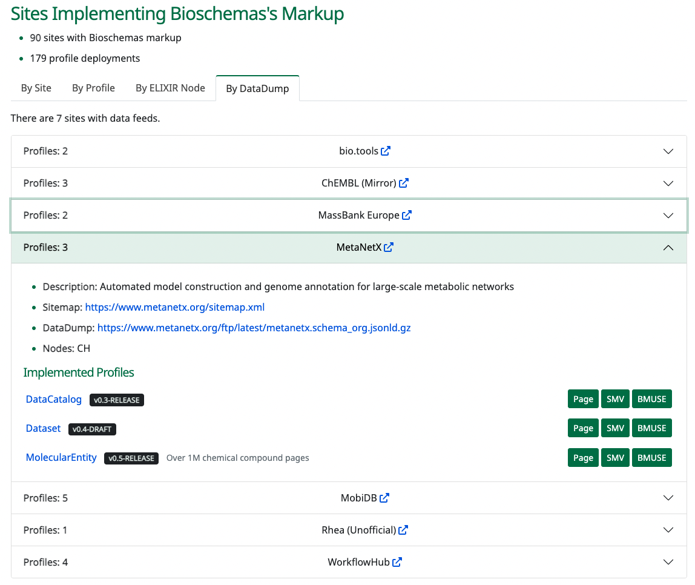

# Introduction

Bioschemas provides a lightweight vocabulary for making the content of Web pages machine processable. However, as shown in Project 29 at BioHackathon 2021 [@gray_papadopoulos_gaignard_rosnet_mičetić_moretti_2022], harvesting markup by visiting each page of a site is not feasible for large sites due to the time required to process each page. This approach imposes processing demands on the publisher and consumer. In February 2022, the Schema.org community proposed a mechanism for sharing markup from multiple pages as a DataFeed published at an established location [@sdo_datafeed]. The feed could be a single file with the whole content or split into multiple files based on some aspect of the dataset, e.g. ChEMBL could have a file for proteins and another one for molecular entities. This would reduce processing demands for publishers and consumers and speed up data harvesting.

The aim of this hackathon project is to explore the implementation of the Schema.org proposal from both a producer and consumer perspective, for a variety of resources implementing different Bioschemas profiles. On the consumer side, we will prototype a consumption pipeline that enables these feeds to be ingested into knowledge graphs including IDP Knowledge Graph [@gray_papadopoulos_mičetić_hatos_2021,@GrayEtal:bioschemas-idpkg:swat4hcls2022] and the Open AIRE Research Graph [@doucet_openaire_2019]. To enable the latter, we will also develop additional mappings between Bioschemas profiles and OpenAIRE’s data model. We will need to understand how to mix schema feeds from different sources, possibly exploiting background knowledge from Wikidata to reconcile concepts.

# Publishing Data Dumps

During the BioHackathon, we reviewed the Schema.org proposal for publishing the markup found within a site as a single, or small number of files, at a well known location [@sdo_datafeed]. We also attempted to publish data dumps for several sites.

We found the term DataFeed did not match our understanding of what was being published[^1]. The idea is to publish a dump of the data that would be found by harvesting every page of the site. We provided this as feedback to the Schema.org community in their GitHub Issue Tracker ([#2891](https://github.com/schemaorg/schemaorg/issues/2891#issuecomment-1308587831)) and in a future revision they are likely to change to referring to these as Datasets.

[^1]: Prototypes modelling the MobiDB data dump and associated metadata as a DataFeed can be found on [GitHub](https://github.com/elixir-europe/biohackathon-projects-2022/tree/datafeedv1/23/datafeeds).

## Data Dump Files

To allow for the creation of data dumps, we needed to provide guidelines on the structure of the data file. The expectation is that the `jsonld` files will contain all markup that would be extracted by visiting each page of the site without duplication of markup. There can be multiple `jsonld` files for the site, e.g. you could decide to have one file per major data type of the site.

Each `jsonld` file should contain a single array of `json` objects, see example below which is a snippet of the [prototype MobiDB file](https://github.com/elixir-europe/biohackathon-projects-2022/blob/datafeedv1/23/datadownload/dump.jsonld) (also available on JSON-LD Playground [full](https://json-ld.org/playground/#startTab=tab-expanded&json-ld=%5B%7B%22%40context%22%3A%22https%3A%2F%2Fschema.org%22%2C%22includedInDataset%22%3A%22https%3A%2F%2Fmobidb.org%2F%232021-11%22%2C%22%40type%22%3A%22Protein%22%2C%22%40id%22%3A%22https%3A%2F%2Fmobidb.org%2FP0DTC9%22%2C%22http%3A%2F%2Fpurl.org%2Fdc%2Fterms%2FconformsTo%22%3A%7B%22%40id%22%3A%22https%3A%2F%2Fbioschemas.org%2Fprofiles%2FProtein%2F0.11-RELEASE%22%2C%22%40type%22%3A%22CreativeWork%22%7D%2C%22identifier%22%3A%22https%3A%2F%2Fidentifiers.org%2Fmobidb%3AP0DTC9%22%2C%22sameAs%22%3A%22http%3A%2F%2Fpurl.uniprot.org%2Funiprot%2FP0DTC9%22%2C%22name%22%3A%22Nucleoprotein%22%2C%22hasBioPolymerSequence%22%3A%22MSDNGPQNQRNAPRITFGGPSDSTGSNQNGERSGARSKQRR...%22%2C%22hasSequenceAnnotation%22%3A%5B%7B%22%40type%22%3A%22SequenceAnnotation%22%2C%22%40id%22%3A%22https%3A%2F%2Fmobidb.org%2FP0DTC9%23prediction-disorder-mobidb_lite.1_51%22%2C%22sequenceLocation%22%3A%7B%22%40type%22%3A%22SequenceRange%22%2C%22%40id%22%3A%22https%3A%2F%2Fmobidb.org%2FP0DTC9%23sequence-location.1_51%22%2C%22http%3A%2F%2Fpurl.org%2Fdc%2Fterms%2FconformsTo%22%3A%7B%22%40id%22%3A%22https%3A%2F%2Fbioschemas.org%2Fprofiles%2FSequenceRange%2F0.1-DRAFT%22%2C%22%40type%22%3A%22CreativeWork%22%7D%2C%22rangeStart%22%3A1%2C%22rangeEnd%22%3A51%7D%2C%22additionalProperty%22%3A%7B%22%40type%22%3A%22PropertyValue%22%2C%22name%22%3A%22Term%22%2C%22value%22%3A%7B%22%40type%22%3A%22DefinedTerm%22%2C%22%40id%22%3A%22https%3A%2F%2Fdisprot.org%2Fassets%2Fdata%2FIDPO_v0.2.owl%23IDPO%3A00076%22%2C%22inDefinedTermSet%22%3A%7B%22%40type%22%3A%22DefinedTermSet%22%2C%22%40id%22%3A%22https%3A%2F%2Fdisprot.org%2Fassets%2Fdata%2FIDPO_v0.2.owl%22%2C%22name%22%3A%22IDP%20ontology%22%7D%2C%22termCode%22%3A%22IDPO%3A00076%22%2C%22name%22%3A%22Disorder%22%7D%7D%2C%22description%22%3A%22Protein%20disordered%20region%20predicted%20by%20MobiDB-lite%22%7D%5D%7D%2C%7B%22%40context%22%3A%22https%3A%2F%2Fschema.org%22%2C%22includedInDataset%22%3A%22https%3A%2F%2Fmobidb.org%2F%232021-11%22%2C%22%40type%22%3A%22Protein%22%2C%22%40id%22%3A%22https%3A%2F%2Fmobidb.org%2FP04637%22%2C%22http%3A%2F%2Fpurl.org%2Fdc%2Fterms%2FconformsTo%22%3A%7B%22%40id%22%3A%22https%3A%2F%2Fbioschemas.org%2Fprofiles%2FProtein%2F0.11-RELEASE%22%2C%22%40type%22%3A%22CreativeWork%22%7D%2C%22identifier%22%3A%22https%3A%2F%2Fidentifiers.org%2Fmobidb%3AP04637%22%2C%22sameAs%22%3A%22http%3A%2F%2Fpurl.uniprot.org%2Funiprot%2FP04637%22%2C%22name%22%3A%22Cellular%20tumor%20antigen%20p53%22%2C%22hasBioPolymerSequence%22%3A%22MEEPQSDPSVEPPLSQETFSDLWKLLPENNVLSPLPSQ...%22%2C%22hasSequenceAnnotation%22%3A%5B%7B%22%40type%22%3A%22SequenceAnnotation%22%2C%22%40id%22%3A%22https%3A%2F%2Fmobidb.org%2FP04637%23prediction-disorder-mobidb_lite.50_96%22%2C%22sequenceLocation%22%3A%7B%22%40type%22%3A%22SequenceRange%22%2C%22%40id%22%3A%22https%3A%2F%2Fmobidb.org%2FP04637%23sequence-location.50_96%22%2C%22http%3A%2F%2Fpurl.org%2Fdc%2Fterms%2FconformsTo%22%3A%7B%22%40id%22%3A%22https%3A%2F%2Fbioschemas.org%2Fprofiles%2FSequenceRange%2F0.1-DRAFT%22%2C%22%40type%22%3A%22CreativeWork%22%7D%2C%22rangeStart%22%3A50%2C%22rangeEnd%22%3A96%7D%2C%22additionalProperty%22%3A%7B%22%40type%22%3A%22PropertyValue%22%2C%22name%22%3A%22Term%22%2C%22value%22%3A%7B%22%40type%22%3A%22DefinedTerm%22%2C%22%40id%22%3A%22https%3A%2F%2Fdisprot.org%2Fassets%2Fdata%2FIDPO_v0.2.owl%23IDPO%3A00076%22%2C%22inDefinedTermSet%22%3A%7B%22%40type%22%3A%22DefinedTermSet%22%2C%22%40id%22%3A%22https%3A%2F%2Fdisprot.org%2Fassets%2Fdata%2FIDPO_v0.2.owl%22%2C%22name%22%3A%22IDP%20ontology%22%7D%2C%22termCode%22%3A%22IDPO%3A00076%22%2C%22name%22%3A%22Disorder%22%7D%7D%2C%22description%22%3A%22Protein%20disordered%20region%20predicted%20by%20MobiDB-lite%22%7D%5D%7D%5D)/[short](https://json-ld.org/playground/#startTab=tab-expanded&json-ld=%5B%7B%22%40context%22%3A%22https%3A%2F%2Fschema.org%22%2C%22includedInDataset%22%3A%22https%3A%2F%2Fmobidb.org%2F%232021-11%22%2C%22%40type%22%3A%22Protein%22%2C%22%40id%22%3A%22https%3A%2F%2Fmobidb.org%2FP0DTC9%22%2C%22http%3A%2F%2Fpurl.org%2Fdc%2Fterms%2FconformsTo%22%3A%7B%22%40id%22%3A%22https%3A%2F%2Fbioschemas.org%2Fprofiles%2FProtein%2F0.11-RELEASE%22%2C%22%40type%22%3A%22CreativeWork%22%7D%2C%22identifier%22%3A%22https%3A%2F%2Fidentifiers.org%2Fmobidb%3AP0DTC9%22%2C%22sameAs%22%3A%22http%3A%2F%2Fpurl.uniprot.org%2Funiprot%2FP0DTC9%22%2C%22name%22%3A%22Nucleoprotein%22%7D%2C%7B%22%40context%22%3A%22https%3A%2F%2Fschema.org%22%2C%22includedInDataset%22%3A%22https%3A%2F%2Fmobidb.org%2F%232021-11%22%2C%22%40type%22%3A%22Protein%22%2C%22%40id%22%3A%22https%3A%2F%2Fmobidb.org%2FP04637%22%2C%22http%3A%2F%2Fpurl.org%2Fdc%2Fterms%2FconformsTo%22%3A%7B%22%40id%22%3A%22https%3A%2F%2Fbioschemas.org%2Fprofiles%2FProtein%2F0.11-RELEASE%22%2C%22%40type%22%3A%22CreativeWork%22%7D%2C%22identifier%22%3A%22https%3A%2F%2Fidentifiers.org%2Fmobidb%3AP04637%22%2C%22sameAs%22%3A%22http%3A%2F%2Fpurl.uniprot.org%2Funiprot%2FP04637%22%2C%22name%22%3A%22Cellular%20tumor%20antigen%20p53%22%7D%5D) where it can also be visualised as shown in the screenshot). 

```json
[
  {
    "@context": "https://schema.org",
    "includedInDataset": "https://mobidb.org/#2021-11",
    "@type": "Protein",
    "@id": "https://mobidb.org/P0DTC9",
    "http://purl.org/dc/terms/conformsTo": {
      "@id": "https://bioschemas.org/profiles/Protein/0.11-RELEASE",
      "@type": "CreativeWork"
    },
    "identifier": "https://identifiers.org/mobidb:P0DTC9",
    "sameAs": "http://purl.uniprot.org/uniprot/P0DTC9",
    "name": "Nucleoprotein"
  },
  {
    "@context": "https://schema.org",
    "includedInDataset": "https://mobidb.org/#2021-11",
    "@type": "Protein",
    "@id": "https://mobidb.org/P04637",
    "http://purl.org/dc/terms/conformsTo": {
      "@id": "https://bioschemas.org/profiles/Protein/0.11-RELEASE",
      "@type": "CreativeWork"
    },
    "identifier": "https://identifiers.org/mobidb:P04637",
    "sameAs": "http://purl.uniprot.org/uniprot/P04637",
    "name": "Cellular tumor antigen p53"
  }
]
```



The data dumps should follow the associated profiles and include details of their `@type`, a link to the Schema.org context using the `https` protocol, and a statement of conformance with the `dcterms:conformsTo` property. We have also used a newly proposed property `includedInDataset` to provide a link from the protein description to the dataset in which it can be found.

## Data Dump Metadata

To ensure that the data dumps are FAIR, they should contain a dataset description describing them conforming to the [Bioschemas Dataset Profile](https://bioschemas.org/profiles/Dataset). Note that each dump file is a `schema:DatasetDownload`. Below we include the [MobiDB prototype metadata](https://github.com/elixir-europe/biohackathon-projects-2022/blob/datafeedv1/23/datadownload/DataDownload.jsonld).

```json
{
  "@context": "https://schema.org/",
  "@type": "Dataset",
  "@id": "https://mobidb.org/#2021-11",
  "http://purl.org/dc/terms/conformsTo": {
    "@id": "https://bioschemas.org/profiles/Dataset/0.3-RELEASE-2019_06_14",
    "@type": "CreativeWork"
  },
  "includedInDataCatalog": {
    "@id": "https://mobidb.org/#DataCatalog"
  },
  "distribution": [
    {
      "@type": "DataDownload",
      "encodingFormat": "application/ld+json",
      "contentUrl": "https://mobidb.org/.well-known/protein",
      "dateModified": "2021-11"
    }
  ],
  "url": "https://mobidb.org/",
  "dateModified": "2021-11",
  "version": "4.1",
  "name": "MobiDB (November 2021)",
  "description": "MobiDB is a database of protein disorder and mobility annotations",
  "identifier": "https://mobidb.org/#2021-11",
  "keywords": [
    "IDP"
  ],
  "creator": {
    "@id": "https://biocomputingup.it/#Organization"
  },
  "license": {
    "@type": "CreativeWork",
    "@id": "https://creativecommons.org/licenses/by/4.0/",
    "name": "Creative Commons CC4 Attribution",
    "url": "https://creativecommons.org/licenses/by/4.0/"
  }
}
```

## Live Deploys

Bioschemas maintains a list of [live deployments](https://bioschemas.org/developer/liveDeploys), i.e. sites that are known to contain markup conforming to a Bioschemas profile. We extended the functionality of the live deploys page to include a section on available data dumps. Data dumps can either be associated with an existing known deployment or a completely new deployment. The screenshot below shows the seven sites that are known to have a data dump, with the MetaNetX entry expanded to show its full details.



# Data Harvesting

During the BioHackathon, we started harvesting the data dumps listed on the [live deploy page](https://bioschemas.org/developer/liveDeploys#nav-datadump) and loading them into a [GraphDB](https://graphdb.ontotext.com/) triplestore using a [script](https://github.com/BioSchemas/bioschemas-data-harvesting/blob/8c36d72082c23df52d60ef9d45bc2b2f3f7718df/datadump-loading/datadump-load-script.sh) to fetch, load, and capture provenance about the process. This process was completed after the BioHackathon once the sources had published complete and correct dump files.

Each dataset is loaded into its own named graph. Provance triples are added to the default graph to describe the named graph. The provenance captures where the dump file was acquired from (`pav:retrievedFrom`) and when (`pav:retrievedOn`).

In total, six data dumps were loaded into the triplestore resulting in 47,956,784 triples being loaded. Details of the data loading can be found in the following table.

| Resource                                                     | Format    | Load time                                                    | Notes                                                        |
| ------------------------------------------------------------ | --------- | ------------------------------------------------------------ | ------------------------------------------------------------ |
| [bio.tools](https://raw.githubusercontent.com/bio-tools/content/master/datasets/bioschemas-dump.ttl) | turtle    | 8s                                                           |                                                              |
| [ChEMBL (Mirror)](https://github.com/ammar257ammar/SWAT4HCLS2022-ChEMBL-bioschemas-mapping/releases/download/v1.0.0/json-ld-output.zip) | zip       | 5h2m10s  <br />32s<br />54s<br />40s<br />38s<br />38s<br />46s<br />46s<br />44s<br />43s<br />47s<br />9s<br />1m10s<br />1m7s<br />1m1s<br />50s<br />49s<br />49s<br />46s<br />50s | Each file downloaded and loaded separately                   |
| [MassBank Europe](https://msbi.ipb-halle.de/~sneumann/MassBank-2006.06.jsonld) | jsonld    | 19m42s                                                       |                                                              |
| [MetaNetX](https://www.metanetx.org/ftp/latest/metanetx.schema_org.jsonld.gz) | jsonld.gz | 5h26m33s                                                     | Only 1 million molecular entities due to hard limit set in generation script |
| [MobiDB](https://mobidb.org/.well-known/protein)             | jsonld    | <1s                                                          | Only 1 thousand proteins due to a hard limit in the API      |
| [Rhea (Unofficial)](https://swel.macs.hw.ac.uk/bioschemas-data/BH2022/rhea.jsonld) | jsonld    | 1m24s                                                        |                                                              |

### Post Processing

After loading, it was found that one resource had used the `https` namespace for Schema.org rather than `http`, and one source had used undefined prefixes. A series of update queries of the form shown below were issued to fix these issues.

```SPARQL
WITH <http://bio.tools/>
DELETE {
    ?s ?p <schema:Organization>
}
INSERT {
    ?s ?p <http://schema.org/Organization>
}
WHERE {
    ?s ?p <schema:Organization>
}
```

# Data Analysis

We were able to directly reuse the analysis notebook BioHackathon 2021 [@gray_papadopoulos_gaignard_rosnet_mičetić_moretti_2022] . The notebook includes the HCLS Dataset Description profile statistics queries[^footnote] [@Dumontier_HCLS-datadesc_PeerJ2016], read in from an existing [repository](https://github.com/AlasdairGray/HCLS-Stats-Queries), and a number of [queries](https://github.com/BioSchemas/bioschemas-data-harvesting/tree/main/queries) developed specifically for the analysis of the Bioschemas harvested data.

To use the [notebook (MyBinder launcher)](https://mybinder.org/v2/gh/BioSchemas/bioschemas-data-harvesting/HEAD?labpath=AnalysisQueries.ipynb), you simply need to run all cells and then select the query you would like to execute from the resulting dropdown menu.

We now present the results of the queries obtained from running the notebook over the contents of the triplestore after the six dumps were loaded, i.e. the data values are as they were on 20 December 2022.

[^footnote]: [Dataset Descriptions: HCLS Community Profile §6](https://www.w3.org/TR/hcls-dataset/#s6_6) accessed March 2022

## HCLS Dataset Statistics

We include here a selection of results from some of the HCLS statistics queries. We focus on those providing the most interesting statistics for the available data. For the full set of queries and results, please run the notebook.

### Number of triples

This is the raw count of the number of triples contained in the triplestore repository.

|    triples |
| ---------: |
| 47,956,726 |

### Number of named graphs 

The result presented here is equivalent to number of pages harvested since BMUSE generates a named graph for each page harvested.

| graphs |
| -----: |
|      6 |

### Number of instance per class

There are many different types included in the markup. BMUSE extracts all markup, not just Bioschemas profiles.

The results are ordered by the Class IRI; in the notebook you can edit the query and change the ordering of results.

(12 results)

| Class                                       | distinctInstances |
| :------------------------------------------ | ----------------: |
| http://bioschemas.org/types/FormalParameter |             9,863 |
| http://schema.org/CreativeWork              |            20,023 |
| http://schema.org/DataCatalog               |                 1 |
| http://schema.org/Dataset                   |            89,676 |
| http://schema.org/DefinedTerm               |               101 |
| http://schema.org/DefinedTermSet            |               100 |
| http://schema.org/MolecularEntity           |         3,022,349 |
| http://schema.org/Organization              |                 6 |
| http://schema.org/Person                    |             1,658 |
| http://schema.org/Protein                   |             8,625 |
| http://schema.org/SoftwareApplication       |            26,785 |
| http://schema.org/Taxon                     |             1,238 |

## Bioschemas Queries

The following queries focus on features of interest to the Bioschemas community.

### Instances per Bioschemas Class

Note that due to the data content we need to include some properties with both a Bioschemas namespace and a Schema.org namespace. The initial run of this query return zero results due to the use of the `https` namespace rather than `http`.

The results are ordered by the count of the number of instances; in the notebook you can edit the query and change the ordering of results.

(8 results)

| Class                                 | instances |
| :------------------------------------ | --------: |
| http://schema.org/MolecularEntity     | 3,022,349 |
| http://schema.org/Dataset             |    89,676 |
| http://schema.org/SoftwareApplication |    26,785 |
| http://schema.org/Protein             |     8,625 |
| http://schema.org/Person              |     1,658 |
| http://schema.org/Taxon               |     1,238 |
| http://schema.org/Organization        |         6 |
| http://schema.org/DataCatalog         |         1 |

### Number of Domains

This result informs us how many web domains were harvested. This is approximately equal to the number of datasets, but some sites may host more than one dataset so not necessarily an exact correspondence.

| count |
| ---: |
| 5 |

### Number of Pages per Domain

We now report the number of pages that have been harvested from each domain. Note that we do not understand the empty domain as all markup was extracted from a web domain.

(5 results)

| domain                    | count |
| :------------------------ | ----: |
| swel.macs.hw.ac.uk        |    22 |
| mobidb.org                |     1 |
| msbi.ipb-halle.de         |     1 |
| raw.githubusercontent.com |     1 |
| www.metanetx.org          |     1 |

Note that the `swel.macs.hw.ac.uk` domain corresponds to the ChEMBL resources which were loaded from a local source. The `raw.githubusercontent.com` content corresponds to the bio.tools dump that is hosted on GitHub.

### Count of Types per Domain

We now report the number of instances of each type on each domain. What is intersting here is the fact that Bgee has many proteins listed on their pages.

The results are ordered by the count of the number of instances; in the notebook you can edit the query and change the ordering of results.

(24 results)

| domain                    | type                                        |      count |
| :------------------------ | :------------------------------------------ | ---------: |
| mobidb.org                | http://schema.org/DefinedTerm               |        100 |
| mobidb.org                | http://schema.org/DefinedTermSet            |        100 |
| mobidb.org                | http://schema.org/Protein                   |        100 |
| mobidb.org                | http://schema.org/CreativeWork              |          1 |
| msbi.ipb-halle.de         | http://schema.org/Dataset                   |     89,675 |
| msbi.ipb-halle.de         | http://schema.org/MolecularEntity           |     89,675 |
| msbi.ipb-halle.de         | http://schema.org/CreativeWork              |          2 |
| msbi.ipb-halle.de         | http://schema.org/DefinedTerm               |          1 |
| raw.githubusercontent.com | http://schema.org/SoftwareApplication       |     26,784 |
| raw.githubusercontent.com | http://schema.org/CreativeWork              |     20,013 |
| raw.githubusercontent.com | http://bioschemas.org/types/FormalParameter |      9,863 |
| raw.githubusercontent.com | http://schema.org/Person                    |      1,657 |
| raw.githubusercontent.com | http://schema.org/Organization              |          4 |
| swel.macs.hw.ac.uk        | http://schema.org/MolecularEntity           | 40,333,214 |
| swel.macs.hw.ac.uk        | http://schema.org/Protein                   |    179,025 |
| swel.macs.hw.ac.uk        | http://schema.org/Taxon                     |     25,998 |
| swel.macs.hw.ac.uk        | http://schema.org/CreativeWork              |          1 |
| www.metanetx.org          | http://schema.org/MolecularEntity           |  1,000,000 |
| www.metanetx.org          | http://schema.org/CreativeWork              |          9 |
| www.metanetx.org          | http://schema.org/Organization              |          2 |
| www.metanetx.org          | http://schema.org/DataCatalog               |          1 |
| www.metanetx.org          | http://schema.org/Dataset                   |          1 |
| www.metanetx.org          | http://schema.org/Person                    |          1 |
| www.metanetx.org          | http://schema.org/SoftwareApplication       |          1 |

## Connectivity of the Data

We were interested to gain some insight as to how connected the data was both internally, and how many points where it would link up with other knowledge graphs. The queries in this section focus on the connectedness of the data.

We first investigated the number of nodes that only contained incoming edges. We report the total number of object nodes there are (excluding literals), and the number of edge IRIs, i.e. those that only have incoming properties. Only % of the nodes only contain incoming edges.

| Object IRIs | Edge IRIs |
| ---: | ---: |
|  |  |

We then investigated the number of outgoing links per class. We report here the top 20 results.


# Discussion

*Still to be written*

- Comparison to 2021 [data analysis](https://doi.org/10.37044/osf.io/y6gbq) needs to be done

# Future work

*Needs to be written properly*

- Investigate use of LinkedPipes to automate the process (link to Ammar's paper: https://doi.org/10.37044/osf.io/7f95d)
- Discuss use of dumps with OpenAIRE

# Jupyter notebooks, GitHub repositories and data repositories

***Links below need to be checked and updated***

* GitHub repository: https://github.com/BioSchemas/bioschemas-data-harvesting
* Jupyter Notebook: https://github.com/BioSchemas/bioschemas-data-harvesting/blob/main/AnalysisQueries.ipynb
    * MyBinder launch: https://mybinder.org/v2/gh/BioSchemas/bioschemas-data-harvesting/HEAD?labpath=AnalysisQueries.ipynb
* SPARQL Endpoint: https://swel.macs.hw.ac.uk/data/repositories/bioschemas
  * Snorql Extended Interface: https://swel.macs.hw.ac.uk/bioschemas/
* Data download director: https://swel.macs.hw.ac.uk/bioschemas-data/

# Acknowledgements

This work was done during the BioHackathon Europe 2022 organised by ELIXIR and run in November 2022. We wish to thank the organizers and supporters of the Biohackathon Europe 2022 for offering the venue for improving Bioschemas community efforts.

# References
