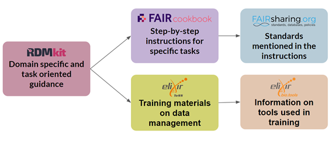
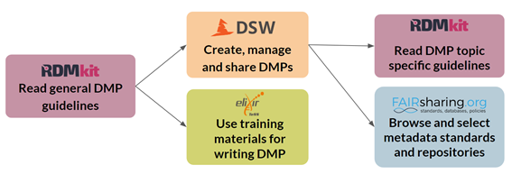
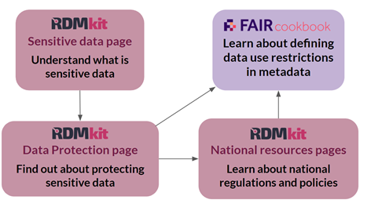
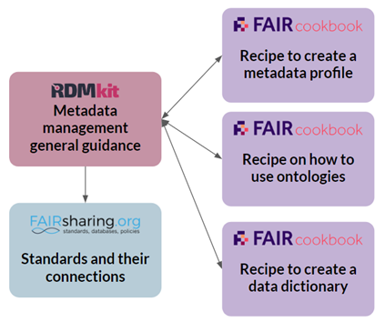
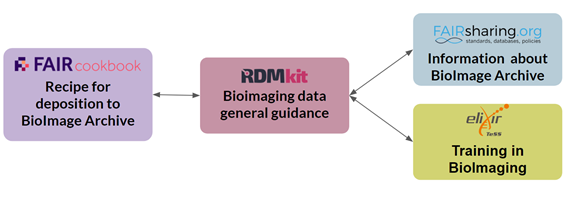
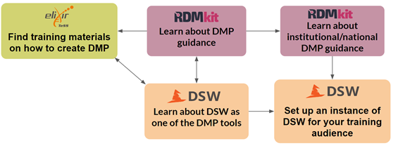

# Introduction

Biohackathon project 31 "The What & How in data management: Improving connectivity between RDMkit and FAIR Cookbook" was proposed by the joint editorial board of the [RDMkit](https://rdmkit.elixir-europe.org) and [FAIR Cookbook](https://faircookbook.elixir-europe.org/content/home.html). The aims of the project were 3-fold:

- Improve the technical interoperability between RDMkit and FAIR Cookbook
- Clarify and illustrate the ELIXIR research data management ecosystem for users
- Perform a gap analysis of the ecosystem for targeted content improvements

# Improving the technical interoperability and sustainability

Multiple initiatives have been initiated and finished at the BioHackathon to improve the interoperability between RDMkit and FAIR Cookbook, and the sustainability of both resources.

## Automatic display of links to RDMkit on the FAIR Cookbook
We created an RDMkit [panel directive](https://github.com/FAIRplus/the-fair-cookbook/blob/main/_ext/rdmkit_panel.py) in the FAIR Cookbook codebase that reads the [mapping file in the joined repository](https://github.com/elixir-europe/faircookbook-rdmkit/blob/main/faircookbook_rdmkit_mapping.yml) and populates a list with RDMkit links in the "What to read next?" section accordingly. Since these links are updated every time the FAIR Cookbook is built, a Cron job was put in place to enforce a weekly rebuild to make sure the FAIR Cookbook has the latest links. This is similar to the time interval when the RDMkit gets updated with FAIR Cookbook links.

## Automatic updating of titles in the mapping file
Over time, page titles can change in both of the resources. We have, thus, put in place a system to keep displayed titles of linked pages in sync with the original resource. A [GitHub Action](https://github.com/elixir-europe/faircookbook-rdmkit/blob/main/.github/workflows/new_content_detection.yaml) will weekly check for title changes using information from the sidebars of RDMkit and FAIR Cookbook and create a pull request updating the titles in the main YAML file where needed.

## Automatic issue creation when new content is added to one of the resources
Due to the changing nature of both resources, we will have to repeat the mapping exercise in the future. To make this job easier, we created a [GitHub Action](https://github.com/elixir-europe/faircookbook-rdmkit/blob/main/.github/workflows/new_content_detection.yaml) that runs weekly to track changes in both resources using GitHub issues which are opened automatically on the [joint repository](https://github.com/elixir-europe/faircookbook-rdmkit). If a new page or a recipe gets added, an issue will be created describing this addition and triggering editorial review.

## Exploring sustainability improvements for the RDMkit 

We looked into the potential of using more formal persistent identifiers (PIDs) for RDMkit pages. The findings of this discussion are listed here on [GitHub](https://github.com/elixir-europe/rdmkit/discussions/1065). This information was used in the editorial board meetings of the RDMkit to decide whether PIDs will be used or not.

As second possible improvement, we explored the idea of parsing metadata information of tools and standards from FAIRsharing and Bio.tools using their respective APIs. A [proof of concept](https://github.com/elixir-europe/rdmkit/pull/1050) was set up and the results where used to feed the discussion in the editorial board meetings of RDMkit. The findings of this discussion can be found on [GitHub](https://github.com/elixir-europe/rdmkit/discussions/1204).

# ELIXIR Research Data Management Ecosystem

A major focus of this project was to generate an improved illustration of the wider ELIXIR Research Data Management (RDM) Ecosystem, its components and how they fit together. While each of the components of the RDM Ecosystem - the RDMkit, the FAIR Cookbook, FAIRsharing, the Data Stewardship Wizard (DSW), Bio.tools and TeSS - are all fairly well-documented in their own right, users from outside of ELIXIR or new to research data management often find it difficult to find all the resources or identify which ones best serve their needs. In order to address this gap, we started the process of creating a single unified presentation page to the ELIXIR RDM Ecosystem, highlighting all its components. In particular, we identified a series of representative journeys that users might take to navigate between the resources in order to address common RDM problems. 

## User journeys

The following six user journeys represent a non-exhaustive list of solutions to common research data management problems, making optimal use of all the ecosystem's resources and links between them. These journeys intentionally range from broader to more specific, with an aim to serve as a starting point for different communities.

### Introduction to the ecosystem

Good management of research data is a cornerstone of ELIXIR’s mission, with a number of endorsed resources available to help researchers tackle data management challenges. Each of the resources presented here cover slightly different angles of data management, from general topic introductions to step-by-step instructions for solving specific problems.
Half a dozen user journeys illustrating some common problems show how to best make use of the resources as you navigate the fascinating world of research data management.
Please note that the list of challenges is not exhaustive and that in some cases, not all available links are explicitly shown. We encourage our readers to explore beyond what is suggested here. Also be aware that all of these are dynamic resources that have new content added all the time.

### User journey 1: How do I start with data management?

Find general guidance on RDM topics, including domain specific and task oriented topics at [RDMkit](https://rdmkit.elixir-europe.org/). Once the considerations that apply are identified, RDMkit links you to step-by-step instructions in the [FAIR Cookbook](https://faircookbook.elixir-europe.org/content/home.html) to help accomplish the tasks needed. Extended information and related resources about the mentioned standards in the FAIR Cookbook can be found in the links to [FAIRsharing](https://fairsharing.org/). In each RDMkit page, there are also links to [TeSS](https://tess.elixir-europe.org/) with relevant training material about your topic of interest. TeSS also links to the [Bio.tools](https://bio.tools/) entry about bioinformatics tools related to the training material.

### User journey 2: How do I write a Data Management Plan?

Get an overview about what entails a Data Management Plan (DMP) in the [Data Management Plan page in the RDMkit](https://rdmkit.elixir-europe.org/data_management_plan#what-should-you-write-in-a-dmp). In the table at the bottom, choose a tool to create DMPs such as the [Data Stewardship Wizard (DSW)](https://ds-wizard.org/). The [Common DSW Knowledge Model](https://registry.ds-wizard.org/) contains links back to the RDMkit to get specific guidelines that are needed to answer some of the questions. Also, the DSW has links to [FAIRsharing](https://fairsharing.org/) to help you choose among repositories, standards and policies to adopt for your project. From RDMkit you can also navigate to [TeSS](https://tess.elixir-europe.org/search?q=%22data+management+plan%22#materials) where you will find DMP related training materials.

### User journey 3: How do I know if my data is sensitive?

Get an overview of what is sensitive data and get general guidance in the [Sensitive data page in the RDMkit](https://rdmkit.elixir-europe.org/sensitive_data#is-your-data-sensitive). Then, navigate to the [Data protection page](https://rdmkit.elixir-europe.org/data_protection) to find out how to protect sensitive data from an ethical and legal standpoint. From this page, follow the links to the [FAIR Cookbook](https://w3id.org/faircookbook/FCB035) to learn about how to represent sensitive data use conditions in machine-readable metadata format. It is also important to consider national regulations and policies that you can read about in the [National resources pages in the RDMkit](https://rdmkit.elixir-europe.org/national_resources).

### User journey 4: How do I handle my metadata?

Understand what to consider when managing the metadata for a project with the [Documentation and metadata page in RDMkit](https://rdmkit.elixir-europe.org/metadata_management). To explore further about the standards used in a specific domain as well as their connections, a link to FAIRsharing is provided. Also, several relevant FAIRcookbook recipes are linked from RDMkit. For example, it is possible to follow instructions on [how to create a metadata profile](https://w3id.org/faircookbook/FCB026), on [how to use ontologies](https://w3id.org/faircookbook/FCB019), or on [how to create a data dictionary](https://w3id.org/faircookbook/FCB025). The FAIR Cookbook recipes also link back to RDMkit for broader context.

### User journey 5: How do I get extra guidance on how to deposit high-throughput data into EBI BioImage Archive?

Learn how to deposit data to the BioImage Archive by following the steps in the [FAIR Cookbook recipe](https://w3id.org/faircookbook/FCB067). In the recipe, [general guidelines on bioimaging data](https://rdmkit.elixir-europe.org/bioimaging_data) and [tool assembly pages](https://rdmkit.elixir-europe.org/omero_assembly) in the RDMkit are linked. There, guidelines in metadata and standards to use and to know how to prepare the data for deposition are described. The RDMkit links to [TeSS](https://tess.elixir-europe.org/materials/rdmbites-bioimage-metadata-rembi) to get training videos about metadata annotation for biological images.

### User journey 6: What existing data management resources can I use to create teaching material for making DMPs?

Explore how existing training materials address the topic of Data Management Planning e.g. through hands-on session, in a form of webinar, or a mix of theoretical and practical content. [TeSS](https://tess.elixir-europe.org/), a training platform by ELIXIR, provides a collection of material used for courses, webinars, and so on. [RDMkit](https://rdmkit.elixir-europe.org/) is also a good starting point to find teaching resources (linked to TeSS) and information on DMP (that can be recommended source for training audience); there, information on current DMP-creating tools such as [DSW](https://ds-wizard.org/) is mentioned. Equally important aspect of creating a DMP is to be familiar with institutional guidelines, and those can be learned about via [national resources section of the RDMkit](https://rdmkit.elixir-europe.org/national_resources).

# Gap analysis

In addition to improving technical interoperability around linking the RDMkit and the FAIR Cookbook, we performed a gap analysis of the content of the two resources. For this, we focused on two aspects i.e. missing links between existing pages, and content gaps.

## Missing page links

We conducted a review of all recipes in the FAIR Cookbook and Task pages in the RDMkit to identify any missing cross-links between pages. During the review, we also analyzed the RDMkit Domain pages, although the decision was made early on that links between Domain pages and FAIR Cookbook recipes would only be acceptable if the recipes are also specific to that domain. This was done to avoid linking overload for common tasks. For example, almost all RDMkit Domain pages mention annotation with ontologies and controlled vocabularies but cross-linking all of them with the FAIR Cookbook's domain agnostic recipe on best practices for ontology selection would generate a long list of poorly related links to the RDMkit on the FAIR Cookbook recipe's page, likely leading to confusion for users. Links to Domain pages are therefore only included where a FAIR Cookbook recipe is entirely specific to the domain in question, such as the [Plant sciences domain page](https://rdmkit.elixir-europe.org/plant_sciences#relevant-tools-and-resources) cross-referencing the FAIR Cookbook recipe "[Plant genomic and genetic variation data submission to EMBL-EBI databases](https://w3id.org/faircookbook/FCB061)".

In total, we identified around a dozen additional links, which were recorded for addition to the YAML file from the technical implementation track. 

In addition to the review of the two core resources, RDMkit and FAIR Cookbook, we also paid attention to potential missing links between these resources and TeSS or DSW. This generated further action items, which were returned to the editorial teams of the appropriate resources for action at a later time. 

## Content gaps

In addition to completing the cross-references between existing pages, we also reviewed the resources for content gaps where no FAIR Cookbook recipes exist to address problems highlighted in an RDMkit Task page, or a problem addressed in a FAIR Cookbook recipe that is not covered in the RDMkit. In total, we identified four potential new recipes for the FAIR Cookbook to address problems described in the RDMkit. Other gaps that were initially identified were deemed to be outside the remit of the FAIR Cookbook, such as problems pertaining to data management planning and project coordination, which are not directly relevant to the FAIR principles. 

  
  
# Discussion & future work

The work presented here addressed an important gap in the alignment of ELIXIR Research Data Management Ecosystem resources. Not only did the project provide great progress in the automation of the interconnection of RDMkit and the FAIR Cookbook, we also laid the foundations for the user journeys that will form a core pillar of the emerging ELIXIR Research Data Management Community. 

The implementation of the technical integration started at the Biohackathon 2022 was completed in the months following the event. An associated editorial process for the approval of future pull requests will be put in place by the RDMkit-FAIR Cookbook joint editorial board. The joint editorial board will also be responsible for driving forward the filling in of the content gaps identified during the hackathon.

The user journeys described here will be extended and reviewed by the emerging ELIXIR RDM community, once it is fully established. The community will take editorial ownership of these journeys and, they will be published on the ELIXIR website in due course.

# Acknowledgements

We thank Stian Soiland-Reyes, Vojtěch Knaisl, Jan Slifka, and Marek Suchánek for technical discussions and advice. We thank the organisers of the BioHackathon Europe 2022 for travel support for several of the authors.

